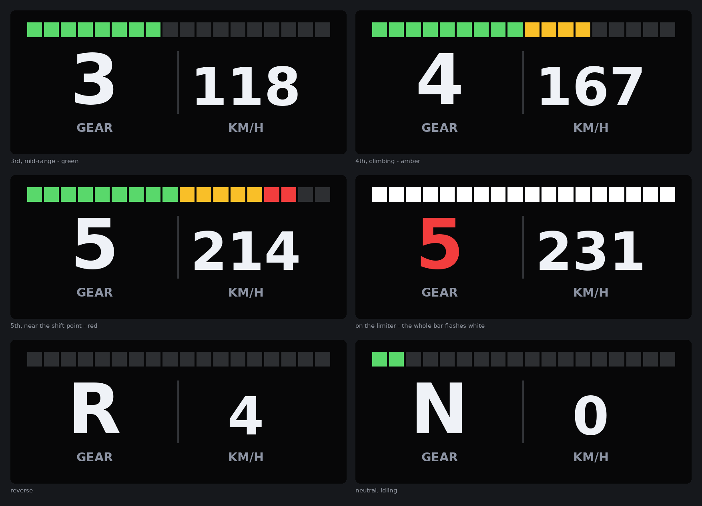
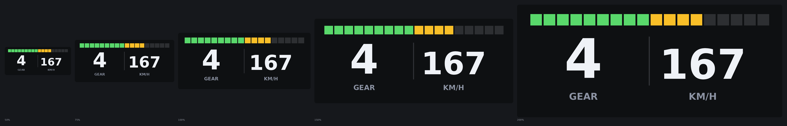

# Gear Speedo

A small in-game dashboard for Assetto Corsa: the gear you're in, road speed,
and an 18-segment RPM bar with shift lights.



The gear is the hero — big, centre-left, and it turns red when you should be
pulling the next one. The bar runs green → amber → red as revs climb, then the
whole thing flashes white on the limiter.

## 1. Install

The folder layout here mirrors the Assetto Corsa install directory, so you can
either:

**Drag and drop into Content Manager** — zip the `apps` and `content` folders
together so they sit at the root of the zip, then drop the `.zip` onto Content
Manager's window.

**Or copy by hand** — merge these two folders into your AC install root:

```
<AC root>/apps/python/GearSpeedo/...
<AC root>/content/gui/icons/Gear Speedo_ON.png     (sidebar icon)
<AC root>/content/gui/icons/Gear Speedo_OFF.png
```

`<AC root>` is usually
`C:\Program Files (x86)\Steam\steamapps\common\assettocorsa`. In Content
Manager, **Settings → Assetto Corsa** shows the path it's using if you're not
sure.

The folder has to stay named exactly `GearSpeedo` — AC imports
`apps/python/GearSpeedo/GearSpeedo.py`, and the folder and file names must match.

## 2. Turn it on

Two switches, both in Content Manager under
**Settings → Assetto Corsa → Apps**:

1. Tick **Enable Python apps**. This is global — if it's off, no Python app
   loads at all.
2. Find **Gear Speedo** in the activated-apps list and tick it.

Both switches just write ini files, so you can set them by hand instead:
`ENABLE_PYTHON=1` under `[PYTHON]` in
`Documents\Assetto Corsa\cfg\gameplay.ini`, and `ACTIVE=1` under
`[GEARSPEEDO]` in `Documents\Assetto Corsa\cfg\python.ini`.

## 3. Put it on screen

Start a session, then **move the mouse to the right edge of the screen** — the
app bar slides out. Scroll to **Gear Speedo** (the speedometer icon) and click
it. The widget appears on track.

**To move it:** drag it with the mouse while the app bar is showing. AC handles
this itself — every app window is draggable.

If you'd rather have an explicit handle to grab, set `TITLE_BAR=1` in the ini
and it gets a normal titled window you can drag by the bar.

**To resize it:** click the small **size** button in the bottom-right corner of
the widget. A scale spinner drops down underneath — 50% to 200%, in steps of
10. It resizes live, and the new size is written back to the ini so it's
remembered next session.



If the ini can't be written — AC installed under `Program Files` without write
access is the usual reason — the scale still applies for the session, it just
won't stick. Set `SCALE` in Content Manager instead and it will.

## Settings

Content Manager builds a settings page automatically from `GearSpeedo.ini` —
same place, **Settings → Assetto Corsa → Apps**, then pick Gear Speedo. Or edit
the file directly:

| Setting | Default | What it does |
| --- | --- | --- |
| `SCALE` | `100` | App size, 50–200%. Also settable in-game. |
| `UNITS` | `KMH` | `KMH` or `MPH` |
| `SHOW_SPEED` | `1` | `0` shows just the gear, centred |
| `OPACITY` | `70` | Background opacity, 0–100% |
| `SHIFT_AT` | `95` | Where the shift flash starts, as a share of the rev limit |
| `TITLE_BAR` | `0` | `1` adds a title bar to drag the widget by |

Apart from `SCALE`, settings are read once when the app loads, so changes apply
from the next session rather than mid-drive. Anything missing, malformed or out
of range falls back to the default rather than breaking the app.

## How it finds the rev limit

This is the one interesting bit. The bar needs to know the car's rev limit, and
Assetto Corsa's Python API doesn't expose it — there's no `maxRPM`. Apps
normally read it out of the game's shared memory, but that needs `ctypes`, and
`ctypes` doesn't work in AC's embedded Python unless the app ships its own
compiled `.pyd` binaries for both 32- and 64-bit.

So this app doesn't do that. It works out the limit instead:

- It watches `IsEngineLimiterOn`, which the API *does* expose. The moment the
  limiter cuts in, the current RPM is the rev limit, near enough exactly.
- Until that first bounce off the limiter, it scales the bar to the highest RPM
  it has seen so far plus a little headroom.

In practice the bar is roughly right from the first corner and exactly right
the first time you hit the limiter. It relearns when you change car. The
tradeoff is deliberate: no binaries to ship, nothing to install, and it runs on
both `acs.exe` and `acs_x86.exe` unchanged.

## If it doesn't show up

An AC app that throws an exception doesn't report an error — it just silently
never appears in the sidebar. Check, in order:

1. `Documents\Assetto Corsa\logs\py_log.txt` — tracebacks land here, prefixed
   with the app name. This app also logs `GearSpeedo: loaded` on a good start,
   so if you don't see that line it never got off the ground.
2. `Documents\Assetto Corsa\logs\log.txt` — search for `GearSpeedo`.
3. The in-game console — the **Home** key toggles it.

Common causes: the folder isn't named exactly `GearSpeedo`, or **Enable Python
apps** is off, or the app is installed but not ticked in the activated list.

## Notes

- Written against AC's embedded Python 3.3, so no f-strings and no stdlib
  newer than 3.3.
- Everything is drawn from `on_render`. AC discards `gl*` calls made anywhere
  else, which is the usual reason a HUD draws nothing.
- Gear values from the API are offset by one: `0` is reverse, `1` is neutral,
  `2` is first. `format_gear` handles it.
- The scale spinner queues its change and `acUpdate` applies it on the next
  tick, rather than re-laying out controls from inside their own callback.
