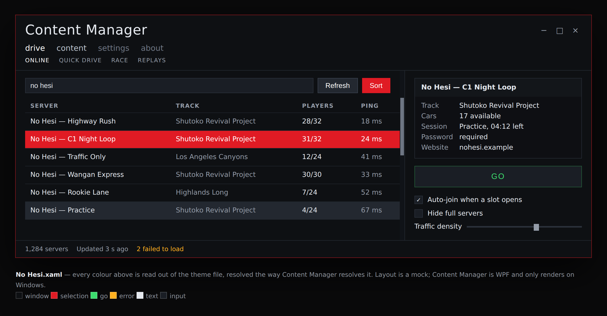

# No Hesi — a Content Manager theme

Night on the highway. Cold asphalt behind everything, lane-paint white text,
taillight red on the row you have selected, sodium amber for anything that
wants attention, and the GO button still green.



That picture is generated from `Themes/No Hesi.xaml` itself — every colour in
it is read out of the file and resolved the way Content Manager resolves it.
The layout is a mock: Content Manager is a WPF app and only draws on Windows,
so nothing here can screenshot the real thing.

## Install

**Drag and drop.** Drop `No Hesi.zip` onto Content Manager's window. It
recognises the file as a theme, offers "New CM theme No Hesi", and files it in
the right folder.

**Or copy it by hand** into whichever of these your Content Manager uses:

| Install | Folder |
| --- | --- |
| normal | `%LOCALAPPDATA%\AcTools Content Manager\Themes\` |
| portable (its exe name has "local" in it) | `<folder with the exe>\Data\Themes\` |
| started with `--storage-location=…` | `<that path>\Themes\` |

The file has to sit directly in `Themes`; Content Manager only lists `.xaml`
files at the top level of that folder, never in subfolders.

Then **Settings → Appearance → Theme → No Hesi**. It shows up without a
restart, and Content Manager re-applies the file every time you save an edit
to it, so you can tune colours with the app open.

## Set the accent colour too

On the same settings page, set the colour picker to **`#E01B24`**.

Content Manager keeps the accent as a per-user setting and writes it straight
into the running app, on top of whatever theme is loaded — a theme cannot set
it. Around a hundred places in its UI paint directly from that accent. The
theme uses its own literal red everywhere it can, so lists, buttons and grids
look right either way, but until the accent matches you will see the odd
leftover blue icon or highlight.

## What it changes

158 of the 167 keys Content Manager themes from, so nothing is left sitting at
the stock grey. The parts worth calling out:

- **Selection is red.** The chosen server, car or track gets a taillight-red
  bar with white text. Half-highlights use the same red as diagonal hazard
  stripes, which is an alternative Content Manager ships commented out in its
  own default theme.
- **Errors are amber, not red.** Red is doing selection here, and a warning
  that looks like a highlighted row is a warning nobody reads. Content
  Manager's own default is orange-red, so this only pushes it further round
  the wheel, far enough that it cannot be taken for the selection bar.
  Rating stars are white rather than amber for the same reason: they sit in
  the same row as warnings.
- **Links are headlight blue** so they never read as selection.
- **GO stays green.** It is the one control found by muscle memory.
- **The loading glow is red** — taillights in the mirror while a session loads.

| | |
| --- | --- |
| `#0E1013` | asphalt, the window itself |
| `#1A1E25` | inputs and buttons |
| `#232830` | hover |
| `#E4E8EE` | lane paint, body text |
| `#949CA8` | dimmed text |
| `#E01B24` | taillight, selection and accent |
| `#FFB020` | sodium, warnings |
| `#7FC7FF` | headlight, links |
| `#3DDC6E` | green, GO |

Not affiliated with the No Hesi servers or their operators. It is a palette
that looks like the game those servers run, nothing more.

## Changing it

The surfaces you actually notice come from the `NoHesi…` entries at the top, so
editing one of those carries through the whole theme. The rest are literals
where a shared value would not have helped: disabled greys, the odd border
tint, medal colours, and the card and overlay brushes that are asphalt at
partial alpha. Save the file and Content Manager re-applies it immediately.

Two checks live next door in `../verify/`:

```bash
python3 ../verify/check-cm-theme.py "Themes/No Hesi.xaml"
python3 ../verify/preview-cm-theme.py "Themes/No Hesi.xaml" preview.html
```

The picture at the top is that HTML, captured in a browser; the script writes
the page, not the PNG.

The first reads the file the way Content Manager does and reports what it
would silently ignore: a key Content Manager never looks up (a typo in a key
is not an error, the colour just never appears), a colour WPF cannot parse, a
resource reference that resolves to nothing, a `StaticResource` pointing
further down the file (which drops the whole theme), a byte-order mark (which
stops the drag-and-drop install being recognised at all), and the WCAG
contrast of every text-on-background pair the app actually draws. The second
writes the preview page. `../verify/cm-theme-keys.json` is the key inventory
both use, extracted from Content Manager's own default theme dictionary.

If Content Manager cannot parse the file it does not say so loudly. Either
way it prints the parser's message in red under the theme dropdown: on a save
it keeps the colours it already had, and if you pick the theme from the
dropdown while it is broken it falls back to the stock Nordschleife theme.
