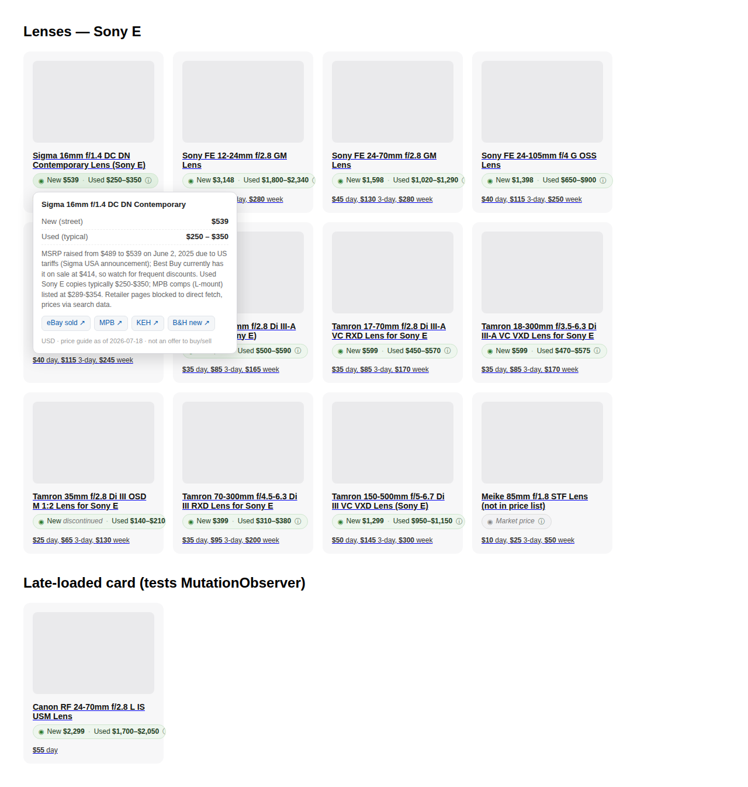

# Lens Price Peek 📷💰

A Chrome + Firefox extension that shows the **real-world market price — new and used —**
of camera lenses right on rental sites like [Helix Rentals](https://www.helixrentals.com),
so you always know how a rental rate compares to just buying the thing.



## What it does

- **Price badges on lens cards** — on helixrentals.com, every product whose title reads
  like a lens ("Sony FE 24-70mm f/2.8 GM Lens") gets a badge:
  `New $2,198 · Used $950–$1,250 · eBay sold $1,040`
- **Bundled price guide** — new street prices (B&H/Adorama/Amazon US) and typical used
  ranges (MPB / KEH / eBay sold) for 56 popular Sony E, Canon EF/RF, and Nikon F/Z
  lenses, researched and cross-verified (July 2026).
- **Live used prices** — optionally queries recent **eBay sold listings** and shows the
  trimmed median of actual completed sales (cached for 24 h). This keeps "used" honest
  even as the market moves.
- **Details popover** — click a badge for the full breakdown plus one-click searches on
  eBay sold, MPB, KEH, and B&H.
- **Popup lookup** — search any lens by name from the toolbar; works on any site.
- **Scan any page** — a popup button injects the scanner into whatever page you're on
  (KEH, craigslist, a forum thread…).
- **Right-click lookup** — select a lens name anywhere → "Look up lens price".

No accounts, no tracking. The only network request the extension ever makes is the
optional eBay sold-listings fetch (toggle it off in the popup if you don't want it).

## Install

### Chrome / Edge / Brave
1. Open `chrome://extensions`
2. Enable **Developer mode** (top right)
3. **Load unpacked** → select the `lens-price-extension/` folder

### Firefox (121+)
1. Open `about:debugging#/runtime/this-firefox`
2. **Load Temporary Add-on…** → select `lens-price-extension/manifest.json`

For a permanent Firefox install, zip the folder contents and submit to AMO for signing
(`about:addons` requires signed extensions outside of temporary loading).

## How matching works

No fragile CSS selectors: the content script walks the page's text and flags anything
shaped like a lens name (brand + focal length + aperture). Each candidate is parsed —
focal range, max aperture, brand, mount hints (FE/RF/EF/Z/AF-S), and generation
(GM vs GM II, IS II vs IS III, Tamron G2) — and matched against the database with hard
constraints, so a "24-70mm f/2.8 GM" never shows GM II prices. Unrecognized lenses still
get a badge with marketplace search links.

## Updating prices

Prices drift. The bundle records its `asOf` date (shown in every popover) and the
live eBay toggle covers the used side day-to-day. To refresh the whole guide:

```sh
node scripts/build-db.mjs research.json   # see script header for the input format
```

## Development

```sh
node scripts/gen-icons.mjs      # regenerate icons
node test/matcher.test.mjs      # matcher unit tests
node test/e2e.mjs               # loads the extension into Chromium against test/fixture.html
```

## Disclaimers

Prices are **estimates for orientation**, not offers or appraisals. "New" is typical US
street price; "Used" is a typical good-to-excellent retail range; "eBay sold" is a
trimmed median of recent completed listings for a matching search — check condition,
completeness, and version before buying or selling anything.
